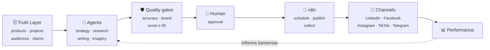
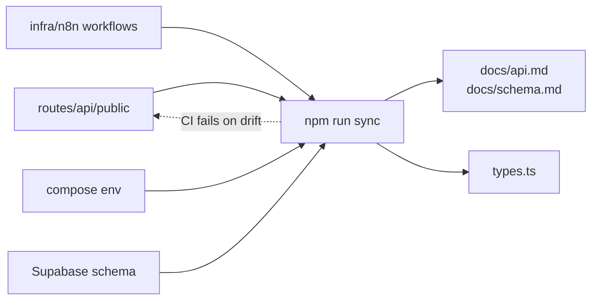

<div align="center">

# Steinheim AI Launchpad

[](LICENSE) [](https://github.com/EslaM-X/steinheim-ai-launchpad/actions)

**A marketing operating system that cannot lie about the product.**

A verified knowledge base drives a team of AI agents that plan, write, illustrate
and quality-check daily content for [Steinheim](https://steinheim-eg.com) —
German luxury bathroom systems in Egypt. Every claim is traced to a fact. Every
post waits for a human.

`TanStack Start` · `React 19` · `Supabase` · `Vercel AI SDK` · `n8n` · `Tailwind 4`

</div>

---

## Why this exists

Most "AI social media" tools generate plausible sentences. For a technical product
sold to architects, developers and hospitality buyers, a plausible sentence is a
liability: an invented flow rate or a fabricated project reference is a claim the
company has to answer for.

So the system is built around two rules that are enforced in code, not in prompts:

> **1. No unverified claim ships.**
> Writers may only state facts that exist in the Truth Layer — approved product
> specifications, approved claims, real projects. An accuracy validator rejects
> everything else _before_ the content is ever scored.
>
> **2. No publish without a human.**
> The AI scores and recommends. `ai_approved` is never sufficient. Only a human
> approval moves a post into the publish queue — from the dashboard or from
> Telegram, never from an agent.

---

## How it works



A single day, end to end: the **Strategist** decides what deserves saying today
based on rotation, audience and past performance. **Research** gathers only
approved facts. **Platform Strategy** decides how the idea lands differently on
each channel. Three **Writers** produce native copy. The **Image agent** writes
the visual brief. The **Accuracy Validator** checks every claim against the Truth
Layer. The **Brand Gatekeeper** scores nine dimensions and blocks anything under
85 or carrying a hard fail. Then it stops, and waits for a person.

### The agent team

| Agent                     | Decides                                                            |
| ------------------------- | ------------------------------------------------------------------ |
| 🧠 **Strategist**         | what to say today, to whom, at which funnel stage                  |
| 🔎 **Research**           | which approved facts support it                                    |
| 🎯 **Platform Strategy**  | how the idea differs per channel                                   |
| ✍️ **Writers** ×3         | native copy for LinkedIn, Facebook, Instagram — Arabic and English |
| 🖼 **Image agent**         | the visual brief, in the brand's language                          |
| 🔍 **Accuracy Validator** | whether every claim is verifiable                                  |
| 🛡 **Brand Gatekeeper**    | whether this deserves to represent the brand                       |
| 🎬 **Creative Studio**    | concept → storyboard → shots → assets, via an external GPU worker  |

Agents never publish. They produce, score, and hand over.

---

## Channels

TikTok and Telegram are first-class in the schema, the adapters and the analytics
from day one — so switching them on is configuration, not a refactor.

| Channel       | Publishing  | Waiting on                                          |
| ------------- | ----------- | --------------------------------------------------- |
| **Telegram**  | ✅ live     | —                                                   |
| **Facebook**  | 🔨 contract | Meta App Review (`pages_manage_posts`)              |
| **Instagram** | 🔨 contract | Business account link + `instagram_content_publish` |
| **LinkedIn**  | 🔨 contract | Community Management API (`w_organization_social`)  |
| **TikTok**    | 🔨 contract | Content Posting API audit (`video.publish`)         |

Telegram is also the **command centre**: `/status`, `/today`, `/pending`,
`/analytics`, with inline approve and reject. Approving queues a post — it never
publishes from the chat.

---

## Quick start

### One button, whole stack (self-hosted)

The production deployment is a single Windows machine with Docker Desktop.
Double-click **`START.bat`** and walk away — the launcher boots Docker, builds
the app, starts `app + n8n + Postgres + tunnel`, waits for every health check,
creates the n8n owner account and its credentials from `.env`, deploys and
activates the four automation workflows, registers the Telegram webhook, and
opens the dashboard. Re-running it after a reboot, a power cut or a network
change simply converges to "everything running".

**`STOP.bat`** stops everything and keeps all data.

First run only: fill `.env` once (the launcher copies it from
`.env.selfhost.example` and opens Notepad). Everything else is automatic —
including on a brand-new machine: copy the project folder + `.env`, press the
button. The full non-technical walkthrough lives in
**[docs/start-here.ar.md](docs/start-here.ar.md)**.

### Developer mode

```bash
npm install
npm run dev
```

| Command               |                                                       |
| --------------------- | ----------------------------------------------------- |
| `npm run dev`         | dev server                                            |
| `npm run typecheck`   | `tsc --noEmit`                                        |
| `npm run build`       | production build                                      |
| `npm run lint`        | eslint                                                |
| `npm run sync`        | regenerate `docs/api.md`, `docs/schema.md`, db types  |
| `npm run sync:check`  | fail when any layer drifted without its mirror        |

Database — 17 migrations, 28 tables, pushed and typed through
`scripts/sb.ps1`:

```powershell
./scripts/sb.ps1 db push        # apply migrations to the linked project
npm run sync                    # regenerate types from the live database
```

---

## Everything stays in sync

Four layers drift apart silently on any real project: routes call nothing,
workflows call dead endpoints, docs describe last month's schema. This repo
enforces the mirrors in code:



`npm run sync:check` runs in CI: a workflow calling a route that no longer
exists, an endpoint nothing consumes (unless justified in an allowlist), stale
generated docs, or a compose variable absent from the example file all fail the
build — and `src/integrations/supabase/types.ts` is regenerated straight from
the linked Supabase project, so migrations and TypeScript never disagree.

---

## Configuration

| Variable                                            | Scope           | Purpose                                                                    |
| --------------------------------------------------- | --------------- | -------------------------------------------------------------------------- |
| `VITE_SUPABASE_URL` `VITE_SUPABASE_PUBLISHABLE_KEY` | client          | public by design                                                           |
| `SUPABASE_URL` `SUPABASE_PUBLISHABLE_KEY`           | server          | SSR and auth middleware                                                    |
| `SUPABASE_SERVICE_ROLE_KEY`                         | **server only** | admin writes, bypasses RLS                                                 |
| `AI_BASE_URL` `AI_API_KEY`                          | **server only** | any OpenAI-compatible endpoint                                             |
| `AI_MODEL` `AI_IMAGE_MODEL`                         | server          | optional overrides                                                         |
| `AI_STREAMING`                                      | server          | set to `false` for providers that reject streaming with structured outputs |
| `AUTOMATION_SECRET`                                 | **server only** | n8n credential                                                             |
| `TELEGRAM_BOT_TOKEN` `TELEGRAM_WEBHOOK_SECRET`      | **server only** | command centre                                                             |
| `TELEGRAM_CHAT_ID` `TELEGRAM_CHANNEL_ID`            | **server only** | ops chat + public channel; channel defaults to the chat                    |
| `CREATIVE_MODE` `CREATIVE_WORKER_SECRET`            | server          | GPU worker channel                                                         |
| `N8N_ENCRYPTION_KEY` `N8N_DB_*`                     | **server only** | n8n's own store — losing the key loses every stored credential             |
| `N8N_OWNER_EMAIL` `N8N_OWNER_PASSWORD`              | **server only** | the account `START.bat` creates and signs in with                          |
| `TUNNEL_TOKEN` `PUBLIC_URL`                         | **server only** | Cloudflare named tunnel + the hostname Telegram is pointed at              |

One `.env` at the repo root feeds the app, n8n, the workflow templates and
every script. There is deliberately no second copy of it anywhere.

Changing LLM provider is a deployment change, never a code change.

---

## Automation API

Four endpoints under `/api/public/automation/` drive the daily cycle from n8n.
They sit under `public` because no Supabase session authenticates them — they are
**not public**.

| Endpoint              |                                                                                                          |
| --------------------- | -------------------------------------------------------------------------------------------------------- |
| `POST generate-today` | run the daily content cycle                                                                              |
| `GET approved`        | the publish queue; `?claim=true` claims atomically, `?state=unknown` lists posts awaiting reconciliation |
| `POST published`      | record the outcome of a publish attempt                                                                  |
| `POST analytics`      | ingest a metrics snapshot                                                                                |

Every request carries a shared secret compared in constant time, a timestamp
inside a five-minute window, and a single-use nonce. Retries carry an
`Idempotency-Key` and get the first attempt's response replayed verbatim.

```bash
curl -X POST "$APP/api/public/automation/generate-today" \
  -H "x-automation-secret: $AUTOMATION_SECRET" \
  -H "x-automation-timestamp: $(date +%s)" \
  -H "x-automation-nonce: $(uuidgen)" \
  -H "idempotency-key: daily-$(date +%F)"
```

### The hard part: never publishing twice

The dangerous failure is not a request that fails. It is a request that **succeeds
while the caller never learns it did**. Retrying that posts the same ad twice.

```
publishing ─┬─ confirmed ────────► published
            ├─ definitive error ─► failed
            └─ no answer ────────► unknown ──► reconcile ──► published
                                                         └─► approved (safe retry)
```

`unknown` never returns to `publishing` on its own, and a claim abandoned by a
dead worker is quarantined rather than re-queued. Backed by
`UNIQUE (platform, platform_post_id)`, `UNIQUE (publish_idempotency_key)` and a
`CHECK` on the status vocabulary.

---

## Security model

Three credentials, never interchangeable: `x-automation-secret` for n8n,
`x-worker-secret` for the GPU worker, `x-telegram-bot-api-secret-token` for
Telegram. A leak of one grants nothing in the others.

Secrets never reach the browser, and this is **enforced rather than documented**:

- the build **fails** if any client module imports a `*.server.ts` file
- only `VITE_*` values are injected into the client bundle
- `social_accounts` and `integrations` grant `authenticated` column-level SELECT
  that excludes every token; only `service_role` can read them

Verify on any build:

```bash
npm run build && grep -rl "SUPABASE_SERVICE_ROLE_KEY\|TELEGRAM_BOT_TOKEN" .output/public
# expect no output
```

Verify a deployment end to end:

```bash
APP_URL=https://<app> AUTOMATION_SECRET=... ./scripts/smoke-automation.sh
```

---

## Project layout

```
src/lib/agents.*        Marketing OS pipeline
src/lib/creative/       Creative Studio
src/lib/platforms/      channel contracts + registry
src/lib/automation/     guard, schemas, approvals, Telegram
src/routes/             dashboard + secured API routes
supabase/migrations/    schema, RLS, grants
infra/n8n/              workflow templates + deploy scripts
infra/selfhost/         one compose file: app + n8n + db + tunnel
scripts/sync/           drift guard between routes, workflows, docs and env
scripts/                START/STOP launchers, smoke test, Supabase helper
docs/api.md             generated endpoint/consumer map — do not edit
docs/schema.md          generated schema reference — do not edit
```

---

## Documentation

|                                              |                                                        |
| -------------------------------------------- | ------------------------------------------------------ |
| **[Start here (عربي)](docs/start-here.ar.md)** | the non-technical operator's guide, in Arabic       |
| **[Go-live checklist](docs/go-live.md)**     | the shortest path from a fresh clone to a working loop |
| **[Architecture](docs/architecture.md)**     | layers, request lifecycle, state machine, data model   |
| **[API map (generated)](docs/api.md)**       | every endpoint and what consumes it                    |
| **[Schema (generated)](docs/schema.md)**     | every table as it exists right now                     |
| **[Deployment](docs/deployment.md)**         | Supabase → Vercel → Telegram → smoke test              |
| **[Contributing rules](AGENTS.md)**          | the invariants any change must preserve                |
| **[Phase plans](docs/plan/)**                | how the system was designed                            |

---

## Contributing

Contributions are welcome — launchpads are only as good as their community.
Start with the [Contributing Guide](CONTRIBUTING.md) and the
[Code of Conduct](CODE_OF_CONDUCT.md), and respect the
[invariants in AGENTS.md](AGENTS.md).

- **Good first issues** are labelled `good first issue` / `good first contribution`.
- Every change keeps `npm run lint` and `npm run typecheck` clean.
- See the [changelog](CHANGELOG.md) for release history.

<div align="center">
<sub>Water, designed. · الماء، بتصميم</sub>
</div>
