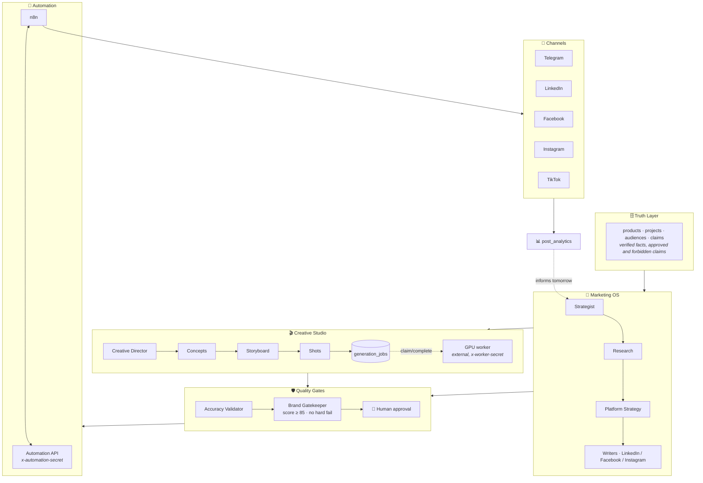
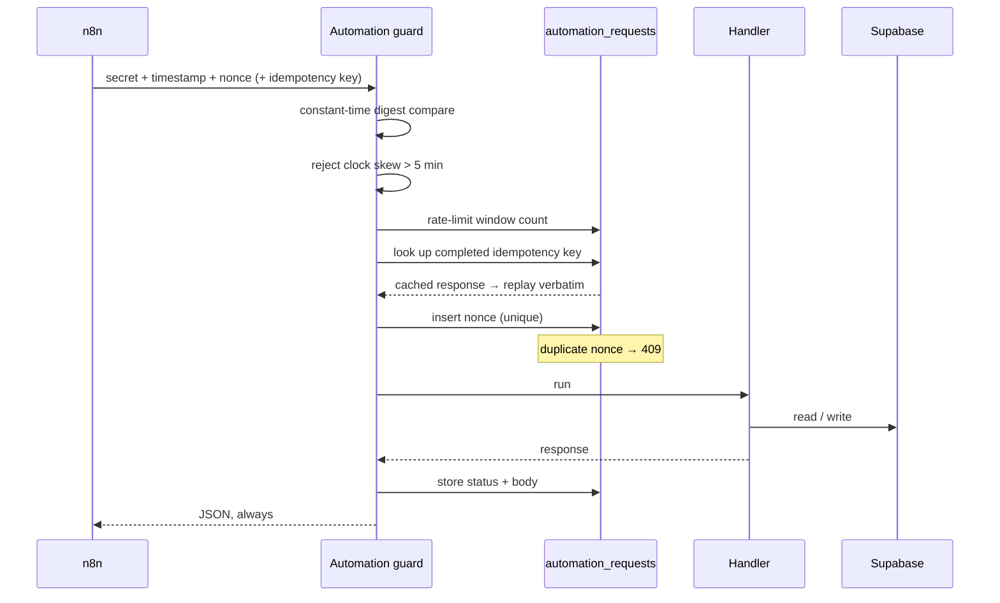
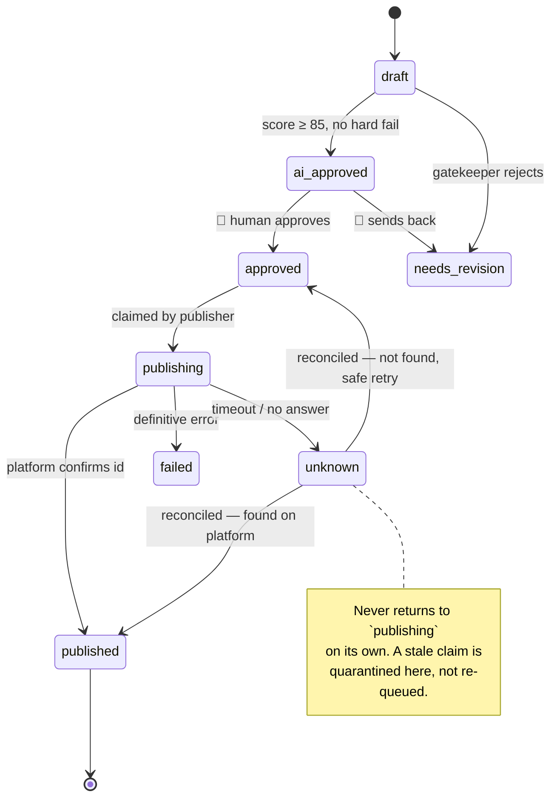
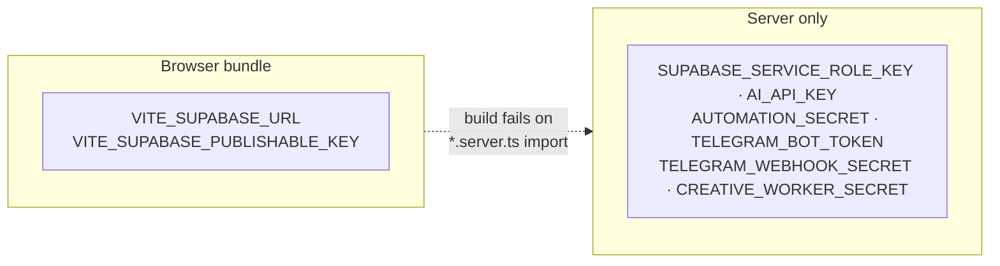

# Architecture

A map of the system: what each layer is responsible for, where the trust
boundaries sit, and which states a post can legally be in.

---

## 1. Layers

Every layer below exists to keep a promise the layer above cannot keep alone.



Two invariants hold the whole thing together:

1. **No unverified claim ships.** Writers may only state facts present in the
   Truth Layer. The accuracy validator rejects the rest before scoring happens.
2. **No publish without a human.** The AI scores and recommends; `ai_approved` is
   never sufficient. Only `human_approved_at` moves a post into the queue.

---

## 2. Planes

```
CONTROL PLANE     the app on Vercel — UI, agents, contracts, API
STATE PLANE       Supabase — Postgres, Auth, Storage, RLS
AUTOMATION PLANE  n8n, self-hosted — scheduling, publishing, collection
EXECUTION PLANE   GPU worker — image, video, voice, FFmpeg
```

The control plane never does heavy work. It writes a job and something else picks
it up. That is what lets the GPU worker move from a laptop to a rented GPU without
the dashboard noticing.

---

## 3. The automation request lifecycle

Routes live under `/api/public/` because no Supabase session authenticates them.
They are not public.



Three separate credentials, never interchangeable:

| Credential | Used by | Reaches |
| --- | --- | --- |
| `x-automation-secret` | n8n | `/api/public/automation/*` |
| `x-worker-secret` | GPU worker | `/api/public/creative/*` |
| `x-telegram-bot-api-secret-token` | Telegram | `/api/public/telegram/webhook` |

---

## 4. Post state machine

The dangerous failure in a publisher is not a request that fails. It is a request
that **succeeds while the caller never learns it did** — retrying that posts the
same ad twice.



Enforced by:

- `UNIQUE (platform, platform_post_id)` — one row per real platform post
- `UNIQUE (publish_idempotency_key)` — one attempt per key
- `CHECK` on `status` — the vocabulary above and nothing else
- `outcome: "not_found"` accepted only from `unknown`

---

## 5. Directory map

```
src/
├── lib/
│   ├── agents.pipeline.ts      Strategist → Research → Platform Strategy →
│   │                           Writers → Image → Accuracy → Gatekeeper
│   ├── agents.server.ts        model access, prompt scaffolding
│   ├── ai-provider.server.ts   any OpenAI-compatible endpoint
│   ├── originality.ts          fingerprinting against recent output
│   ├── scoring.ts              penalties and score bands
│   ├── creative/               Creative Studio: concepts, storyboards, jobs
│   ├── platforms/              channel contracts
│   │   ├── types.ts            specs, adapter interface, error taxonomy
│   │   ├── registry.ts         one lookup for every channel
│   │   ├── telegram.ts         implemented
│   │   └── {linkedin,facebook,instagram,tiktok}.ts   contracts
│   └── automation/             the automation plane's server side
│       ├── guard.server.ts     secret, timestamp, nonce, idempotency, limits
│       ├── schemas.ts          request contracts
│       ├── approvals.server.ts human approval from outside the dashboard
│       └── telegram.server.ts  command centre
├── routes/
│   ├── _authenticated/         dashboard: products, knowledge, calendar,
│   │                           creative, publish, analytics, logs, tests
│   └── api/public/
│       ├── automation/         generate-today · approved · published · analytics
│       ├── creative/           claim · complete   (GPU worker)
│       └── telegram/           webhook
└── integrations/supabase/      browser client, admin client, auth middleware

supabase/migrations/            14 migrations, 26 tables
infra/n8n/                      self-hosted automation plane
scripts/smoke-automation.sh     W00 infrastructure test
```

---

## 6. Data model

26 tables in four groups.

| Group | Tables |
| --- | --- |
| **Truth** | `brand_profile` `categories` `products` `product_images` `audiences` `projects` `claims` |
| **Content** | `content_ideas` `posts` `post_analytics` `agent_runs` |
| **Creative** | `campaigns` `creative_references` `creative_concepts` `storyboards` `shots` `creative_assets` `generation_jobs` `creative_reviews` `ad_variants` |
| **Operations** | `social_accounts` `integrations` `automation_requests` `test_scenarios` `test_runs` `profiles` |

Analytics are stored twice on purpose: canonical columns that compare across every
channel, plus `raw_metrics` for whatever a single platform reports and nobody else
does — TikTok watch-time, LinkedIn demographics, Instagram navigation taps.

---

## 7. Secret handling



Enforced, not documented:

- Vite import protection fails the build if a client module imports `*.server.ts`
- only `VITE_*` values are injected into the client
- `social_accounts` and `integrations` grant `authenticated` **column-level**
  SELECT that excludes every token; only `service_role` can read them

---

## 8. Status

| Phase | State |
| --- | --- |
| E0 Lovable removal | ✅ |
| E2 Social core | ✅ |
| E3 Publish state machine | ✅ |
| E6 Automation API | ✅ code-verified; live verification pending |
| E7 Telegram | ✅ |
| E1 External Supabase | ⏳ |
| E0.5 Vercel | ⏳ |
| W00–W01 n8n | ⏳ blocked on the two above |
| Meta · LinkedIn · TikTok | ⏳ blocked on platform approvals |

The channel table in the README tracks what each platform is waiting on.
